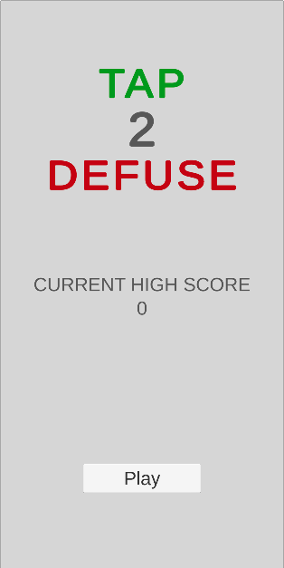
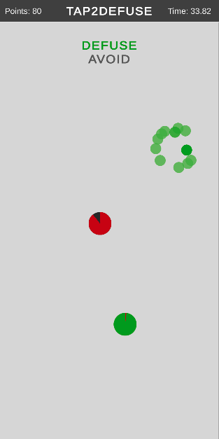
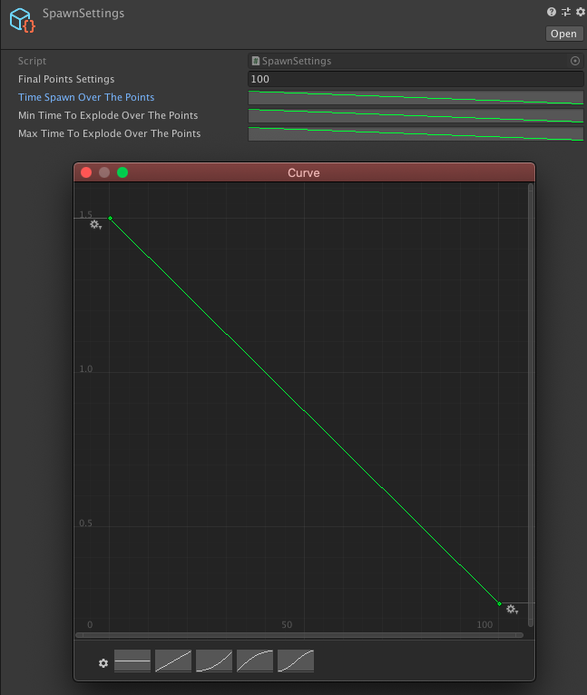
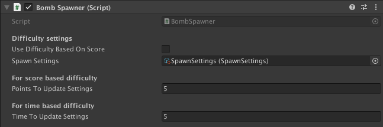

# Tap 2 Defuse

 

## About

Simple mobile game created in Unity in which the Player should tap on the green circle before it turn into red and avoid the black ones.

## Difficulty settings

In editor you can change difficulty settings by modifying or creating new `SpawnSettings` ScirptableObject.

- FinalPointsSettings - on this value shuld end every animationCurve in current SpawnSettings
- TimeSpawnOverThePoints - curve describing time to spawn next bomb depends on user points or game time
- MinTimeToExplodeOverThePoints - curve describing minimum time for fill green circle which can be randomly selected
- MaxTimeToExplodeOverThePoints - curve describing maximum time for fill green circle which can be randomly selected

Game have two difficulty settings based on `SpawnSettings`. 
Difficulty can increased by time or by the user points.

PointsToUpdateSettings - number of defused bombs needed to update difficulty
TimeToUpdateSettings - number of seconds needed to update difficulty